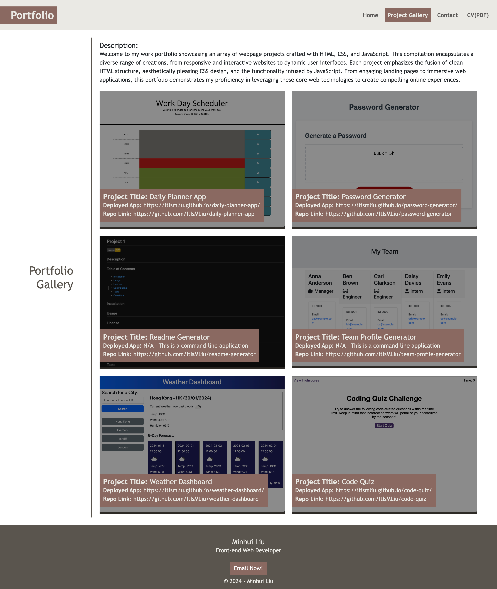
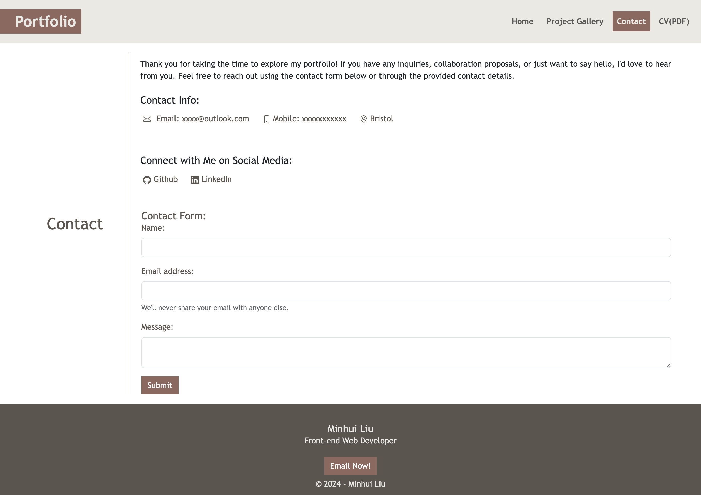

# react-portfolio
Portfolio Showcase: Web Page Created with React

## Description 

This react-portfolio project was created using React to develop the initial scaffolding of my portfolio website. The purpose of the website is to showcase my proficiency in website development, serving as a comprehensive display of my skills and projects for prospective employers. It includes essential details such as my name, photo, work portfolio, bio, and contact information.

All files were created from scratch, incorporating my newly acquired skills in utilizing React. Below, I've highlighted the integration of these skills within the project:

* React
* Navigation with React Router, dynamic rendering, or another third-party router

The URL of the deployed application: https://itismliu.github.io/react-portfolio/

The URL of the GitHub repository: https://github.com/ItIsMLiu/react-portfolio

Screenshot of home page of website when screen width is larger than 992px:

Screenshot of home page of website when screen width is smaller than 768px:

Screenshot of project gallery page:

Screenshot of contact page:

## Installation

N/A

## Usage 

To use the portfolio webpage, you can go through its various sections to explore infomation my projects, skills, infomation about me, my contact details and CV. If you wish to review a specific page, simply utilise the navigation bar located at the top right corner. From there, select one of the four options: 'Home', 'Project Gallery', 'Contact' or 'CV(PDF)' by clicking on your choice. This will promptly take you to the desired section on the webpage, where you can delve into the section contents.

This webpage is compatible with various screen sizes, as its layout will automatically respond and adapt. 

The graphics of the links in the navigation bar, hero, contact, project and footer section will dynamically change as you hover the cursor over them.

In the contact section, links to the contact methods will directly prompt you to email, call, or visit my GitHub and LinkedIn profile.

The footer section contains copyright information and an 'email now!' call-to-action button. 

## Credits

Other resources used as guides:
- 'Resend' Documentation: https://resend.com/docs/send-with-nodejs ; https://github.com/resend/resend-node-example
- Create a React Contact Form with Email.js: https://medium.com/@thomasaugot/create-a-react-contact-form-with-email-js-cad2c8606f33
- Deployment of React Application using GitHub Pages: https://www.geeksforgeeks.org/deployment-of-react-application-using-github-pages/
- Deploying a React App (created using create-react-app) to GitHub Pages: https://github.com/gitname/react-gh-pages?tab=readme-ov-file
- Deploying Vite / React App to GitHub Pages: https://dev.to/rashidshamloo/deploying-vite-react-app-to-github-pages-35hf
- Contact form endpoints: https://getform.io/

## License

MIT license (Please refer to the LICENSE in the repository).